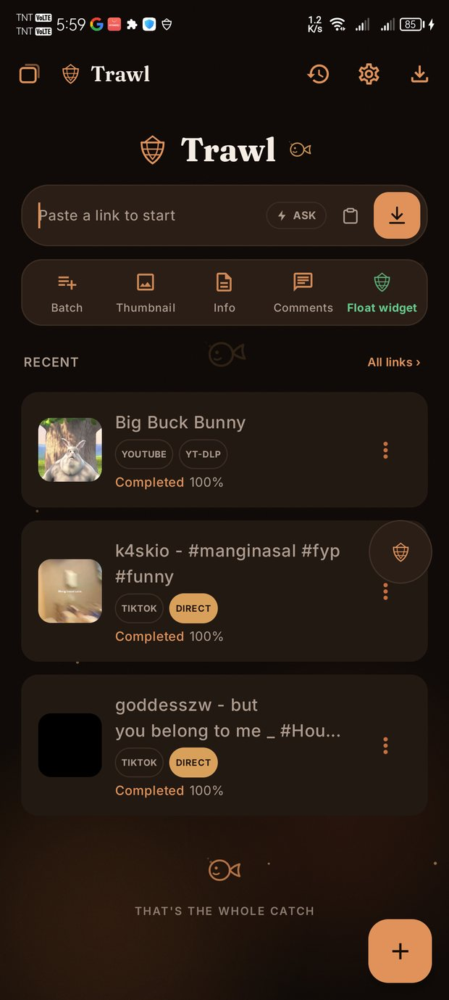
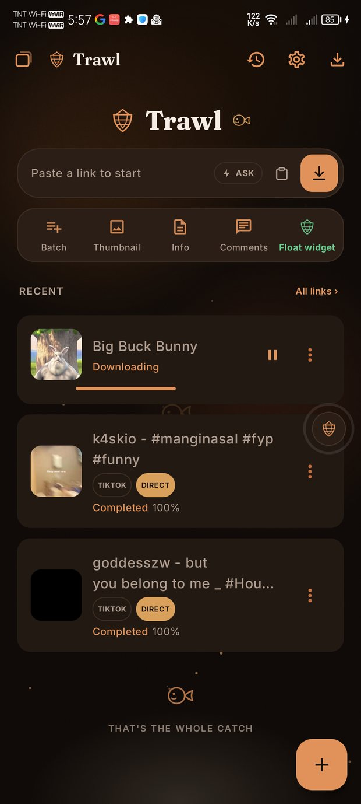
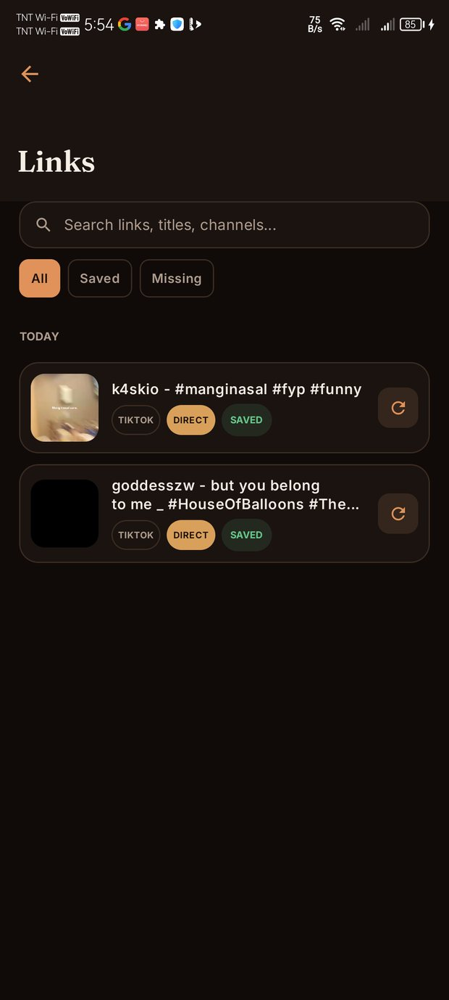
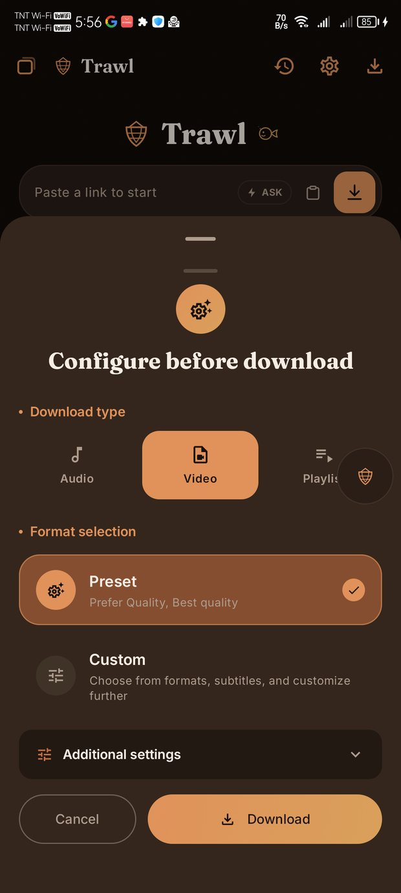
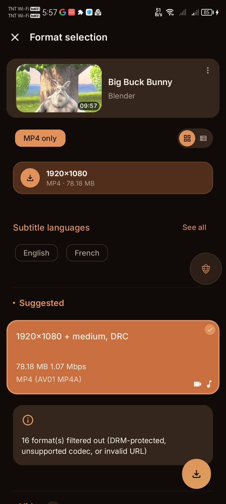
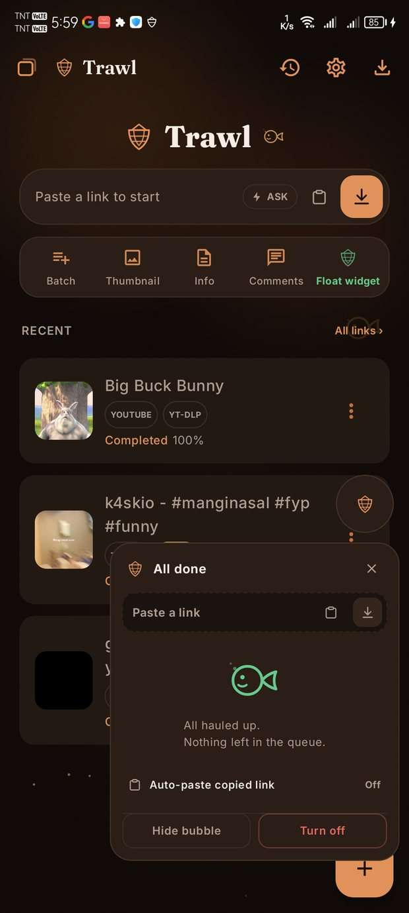

<div align="center">


# Trawl

**A general-purpose media downloader for Android, built to cover a wide range of platforms.**

[](LICENSE)
[](#building-it-yourself)
[](#building-it-yourself)
[](docs/STATUS.md)

A personal fork of **[Seal Plus](https://github.com/MaheshTechnicals/Sealplus)**, itself a fork of
**[Seal](https://github.com/JunkFood02/Seal)**.
Built by **[uukjtisa](https://github.com/uukjtisa)**.

</div>

> [!WARNING]
> **v0.1.0. Early development.** I wrote this for my own phone and I am still finding bugs in it.
> There is no store listing, and until now nobody but me had run it. What is written below is what
> the code does today, not what I hope it will do. See **[docs/STATUS.md](docs/STATUS.md)** for the
> honest list of what is finished, half-built and missing.

---

## Table of Contents

- [What Trawl is](#what-trawl-is)
- [A glimpse of it](#a-glimpse-of-it)
- [Platform support, without the marketing](#platform-support-without-the-marketing)
  - [How the resolvers behave](#how-the-resolvers-behave)
  - [Why X and TikTok specifically](#why-x-and-tiktok-specifically)
  - [Checking any of this yourself](#checking-any-of-this-yourself)
- [The rest of the app](#the-rest-of-the-app)
- [What it is for, and what it will not do](#what-it-is-for-and-what-it-will-not-do)
- [Installing it](#installing-it)
- [Building it yourself](#building-it-yourself)
- [Project status](#project-status)
- [Credits](#credits)
- [Licence](#licence)
- [Documentation](#documentation)

---

## What Trawl is

Every app in this family is a front-end for [yt-dlp](https://github.com/yt-dlp/yt-dlp). Trawl is
still one of those, so it downloads from the same thousand-plus sites Seal does, using the same
engine underneath.

What this fork adds is a second way in.

When yt-dlp's extractor for a site stops working, an ordinary front-end has nothing left to try. It
shows you an extractor error and that is the end of the download. Trawl resolves two sites itself,
without yt-dlp's extractor, and only falls back to yt-dlp when its own attempt comes up empty.

Every download card shows which route actually ran, `DIRECT` or `YT-DLP`, so you can check that
claim in the app instead of taking this file's word for it.

---

## A glimpse of it

<p align="center">
  
  
  
</p>
<p align="center">
  
  
  
</p>

<p align="center"><sub>
Home &middot; download in progress &middot; links history &middot; configure &middot; format
selection &middot; floating window
</sub></p>

---

## Platform support, without the marketing

| Site | How Trawl gets it | Fallback |
|---|---|---|
| **X / Twitter** | Trawl's own resolver, via X's syndication endpoint, then a public mirror for age-restricted posts | yt-dlp |
| **TikTok** | Trawl's own resolver, via TikTok's mobile page and the session cookies its CDN insists on | yt-dlp |
| **Facebook** | Trawl's own resolver, via the watch page. HD and SD | yt-dlp |
| **Newgrounds** | Trawl's own resolver, via its portal JSON. Three rungs, age-restricted entries included | yt-dlp |
| **YouTube** | yt-dlp | &mdash; |
| **Everything else** | yt-dlp | &mdash; |

And some NSFW sites, through yt-dlp rather than a Trawl resolver, listed in
[docs/SUPPORTED-SITES.md](docs/SUPPORTED-SITES.md).

**Four sites have independent tooling. That is the whole list.**

YouTube works well here because yt-dlp is good at YouTube, and the same goes for Reddit, Twitch,
Vimeo and every other site in yt-dlp's catalogue. Trawl adds nothing of its own there. A resolver
is only worth writing where yt-dlp's extractor is unreliable on Android, so a site yt-dlp handles
well is not a gap.

Instagram was tried and does not work signed out: every profile returns the same ~617 KB JavaScript
shell with no post data in it, and the `/embed/` surface returns the same shell for a real reel.
The measurements are in [docs/SUPPORTED-SITES.md](docs/SUPPORTED-SITES.md) along with the one other
site that was measured and rejected.

### How the resolvers behave

A resolver replaces one step: working out which URL holds the video. yt-dlp still fetches the bytes.

That split is deliberate. Transferring the file was never the broken part, and yt-dlp is what gives
you progress, resume, file naming, the history row, notifications and ffmpeg post-processing.
Replacing all of that to save a single HTTP request would trade a working system for a worse copy
of one.

When a resolver cannot answer it returns nothing, and nothing means *try the next route*. It never
raises an error of its own, so the worst case is the behaviour the app had before the resolver
existed. Both resolvers have an off switch in Settings.

### Why X and TikTok specifically

These two kept catching me out, and for different reasons.

yt-dlp's Twitter extractor wants a guest token, and increasingly a logged-in session. On a phone
with no cookies it fails often, and the error tells you nothing useful.

yt-dlp's TikTok path expects a TLS fingerprint that the Android build cannot produce, because
`curl_cffi` is not part of it. The result is `Unable to extract universal data for rehydration` on
links that open fine in a browser.

Neither is yt-dlp's fault. Both meant a link I could watch on the page would not download.

### Checking any of this yourself

I measured every route against the live endpoints before writing a line of Kotlin, including three
TikTok approaches I tried and threw away. Those probes are in [`tools/`](tools/) and still run:

```bash
python tools/probe_twitter.py 1491475671058681863
python tools/probe_tiktok.py  <aweme id> --check-url
```

They answer the first question worth asking when a download breaks: did the endpoint change, or did
the app? No build, no device, a few seconds. [`tools/README.md`](tools/README.md) maps each probe
step to the Kotlin function that implements it, so the two cannot quietly drift apart.

---

## The rest of the app

- **A floating window** that survives leaving the app. Progress per download, pause, retry, a link
  field, clipboard auto-paste, the session's finished downloads, drag to dismiss.
- **Seven warm palettes**, optional glass on the chrome, an ambient background and an intro. All of
  it can be switched off.
- **A links history** with thumbnails, platform and tool labels, status, and one-tap re-download.
- **A window switcher** in place of a plain navigation drawer.
- **Downloads land in your gallery and your music player**, and a tap on a finished row plays it.
- **No ads, analytics, telemetry or accounts.** Nothing is uploaded. The donation, sponsor and
  crypto pages inherited from upstream were deleted rather than hidden.

---

## What it is for, and what it will not do

Trawl saves media from public pages so you can keep it offline. That is the job a browser's "save
video" already does, for sites that do not offer one.

Use it for material you have the right to keep: your own uploads, content you have permission to
save, media offered for download, or work under a licence that allows it. Copyright law and site
terms still apply, they differ by country, and what you do with a file is on you.

It will not get past paywalls, DRM or private accounts. The resolvers read what a signed-out
browser can already see. Where a site gates something behind an account, Trawl says so instead of
failing vaguely.

---

## Installing it

Grab an APK from **[Releases](https://github.com/uukjtisa/trawl/releases)**. Android 7.0 or newer,
and you will need to allow installing from unknown sources.

| File | For |
|---|---|
| `Trawl-*-universal.apk` | Anything. Pick this if you are not sure. |
| `Trawl-*-arm64-v8a.apk` | Almost every phone sold since roughly 2017, at a third of the size. |
| `Trawl-*-armeabi-v7a.apk` | Older 32-bit phones. |
| `Trawl-*-x86_64.apk`, `Trawl-*-x86.apk` | Emulators, and the few x86 Android devices. |

The APKs are signed with my own key rather than a store key, so Android will call the installer
untrusted. That is what a sideloaded build looks like.

---

## Building it yourself

```bash
git clone https://github.com/uukjtisa/trawl.git
cd trawl
./gradlew assembleGenericDebug
```

Android Studio opens the project as is. Gradle resolves the JDK 21 toolchain on its own.

| | |
|---|---|
| Min SDK | 24 (Android 7.0) |
| Target / compile SDK | 37 |
| Language | Kotlin, Jetpack Compose |
| Application id | `dev.niccc2007.trawl` |

`assembleGenericRelease` produces the five APKs above, but only if a `keystore.properties` pointing
at your own signing key sits in the project root. Without one the release build is unsigned and
will not install.

---

## Project status

**[docs/STATUS.md](docs/STATUS.md)** is the honest version: what works, what is half-built, what has
not been started, and what is missing deliberately. Short summary of the gaps I would fix first:

- Audio conversion carries no artwork or tags, and there is no way to extract audio from a file you
  already downloaded.
- Re-downloading a post you already have makes a second copy silently. The prompt that should ask
  first is not built.
- While a link resolves you get a spinner, not a trace of which route is being tried.
- No resolvers beyond X and TikTok. No tests beyond the Python probes.

---

## Credits

Trawl is built on other people's work. [**ATTRIBUTION.md**](ATTRIBUTION.md) records the chain in
full.

| Project | What it does here |
|---|---|
| **[yt-dlp](https://github.com/yt-dlp/yt-dlp)** | The download engine, and the hard part |
| **[youtubedl-android](https://github.com/yausername/youtubedl-android)** | Android bindings and the bundled Python runtime |
| **[Seal](https://github.com/JunkFood02/Seal)** by JunkFood02 | The original app: its architecture, Compose UI and yt-dlp integration are what this is built on |
| **[Seal Plus](https://github.com/MaheshTechnicals/Sealplus)** by MaheshTechnicals | Carried the project forward when the original went quiet |
| **[FFmpeg](https://ffmpeg.org/)** | Media post-processing |
| **[FixTweet](https://github.com/FixTweet/FixTweet)** | The public resolver Trawl falls back to for restricted X posts |

Trawl is not an official build of Seal or Seal Plus, and is not affiliated with either project. It
uses neither project's name, icon nor branding in the app.

---

## Licence

[**GPL-3.0**](LICENSE), inherited and unchanged. The source is here, modified files carry a change
notice, and the attribution chain is intact.

---

## Documentation

| File | What is in it |
|---|---|
| [docs/STATUS.md](docs/STATUS.md) | What works, what is half-built, what is missing |
| [docs/SUPPORTED-SITES.md](docs/SUPPORTED-SITES.md) | Which sites get a Trawl resolver, and which were measured and rejected |
| [docs/ROADMAP.md](docs/ROADMAP.md) | Platforms worth probing next. Nothing here is a commitment |
| [docs/GOALS.md](docs/GOALS.md) | What Trawl is for, and how it differs from Seal and Seal Plus |
| [docs/RESOLVERS.md](docs/RESOLVERS.md) | How each resolver works, what it cannot do, and why |
| [tools/README.md](tools/README.md) | The probes, and how each maps to the Kotlin |
| [ATTRIBUTION.md](ATTRIBUTION.md) | The full upstream chain |
